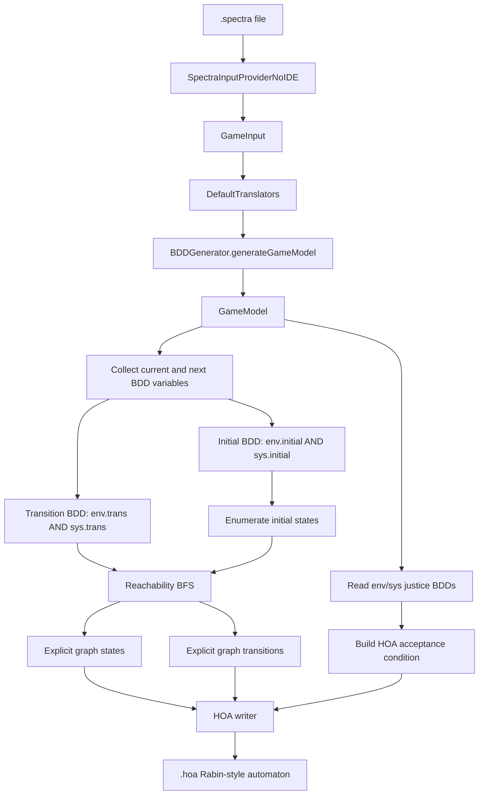

# Spectra CLI HOA Export

This document describes how to use the modified `spectra-cli.jar` from another repository to export a reachable `GameModel` graph from a `.spectra` specification as an HOA automaton with Rabin-style acceptance.

## Artifact

Use this JAR:

```text
spectra-cli.jar
```

In this repository it was generated at:

```text
tau.smlab.syntech.Spectra.cli/lib/spectra-cli.jar
```

You can copy that JAR into another project, for example:

```text
other-project/tools/spectra-cli.jar
```

The JAR is an Eclipse runnable JAR with bundled Spectra/Syntech dependencies. It still needs the native CUDD library when using the default BDD backend.

## Platform Requirements

The original Spectra CLI supports Windows and Linux. macOS is not supported by the upstream tool.

Requirements:

```text
Java runtime
spectra-cli.jar
cudd.dll on Windows, unless using --jtlv
libcudd.so on Linux, unless using --jtlv
```

For Linux with CUDD, make sure the folder containing `libcudd.so` is available:

```bash
export LD_LIBRARY_PATH="$LD_LIBRARY_PATH:/path/to/cudd"
```

For portability between repositories, the simplest first test is to use `--jtlv`, because it avoids native CUDD loading:

```bash
java -jar tools/spectra-cli.jar -i specs/model.spectra --jtlv --export-hoa --hoa-output out/model.hoa
```

## Basic HOA Export

Run:

```bash
java -jar tools/spectra-cli.jar \
  -i specs/model.spectra \
  --export-hoa \
  --hoa-output out/model.hoa \
  --max-states 100000
```

On Windows PowerShell:

```powershell
java -jar tools\spectra-cli.jar `
  -i specs\model.spectra `
  --export-hoa `
  --hoa-output out\model.hoa `
  --max-states 100000
```

If `--hoa-output` is omitted, the CLI writes:

```text
<output-folder>/<spectra-module-name>.hoa
```

If `-o` is omitted too, the output folder defaults to:

```text
out
```

## HOA-Specific Options

```text
--export-hoa
    Export the reachable GameModel graph as an HOA automaton.

--hoa-output <file>
    Write the HOA result to this file.

--max-states <n>
    Maximum number of reachable states to enumerate.
    Default: 100000

--jtlv
    Use the Java BDD backend instead of native CUDD.
    Useful when running from another project without native libraries configured.
```

The existing CLI options still work for the original behavior:

```text
-i, --input
-o, --output
-s, --synthesize
--static
--well-separation
--counter-strategy
--disable-opt
--disable-grouping
-v, --verbose
```

When `--export-hoa` is set, the CLI stops after HOA export. It does not synthesize a controller.

## How the Export Works

The CLI reuses the normal Spectra frontend and translation pipeline. The HOA export starts after the `GameModel` has been built.




## What the GameModel Contributes

The `GameModel` is the source of the exported automaton. It contains the BDD-based game arena produced from the Spectra specification.

The exporter uses:

```text
model.getEnv().initial()
model.getSys().initial()
model.getEnv().trans()
model.getSys().trans()
model.getEnv().justiceAt(i)
model.getSys().justiceAt(i)
model.getEnv().getAllFields()
model.getSys().getAllFields()
```

Conceptually:

```text
Initial states:
  env.initial AND sys.initial

Transitions:
  env.trans AND sys.trans

Acceptance:
  environment justice assumptions and system justice guarantees
```

The exported graph is reachable-only. Starting from all initial valuations, the exporter enumerates successor valuations satisfying the joint transition relation.

## HOA Encoding

The exporter writes:

```text
HOA: v1
States: N
Start: ...
AP: ...
Acceptance: ...
--BODY--
State: ...
[t] ...
--END--
```

Atomic propositions are encoded as variable-value propositions:

```text
"carA=false"
"carA=true"
"mode=IDLE"
"mode=BUSY"
```

Each exported state has a full AP valuation as its state label. Transitions are written with label `[t]`, because the valuation is attached to the target/current states rather than duplicated on every edge.

## Acceptance Condition

For GR(1)-style Spectra specifications, the liveness shape is:

```text
(GF envJustice1 AND ... AND GF envJusticen)
  -> (GF sysJustice1 AND ... AND GF sysJusticem)
```

The exporter writes the equivalent HOA acceptance condition:

```text
Fin(envJustice1) OR ... OR Fin(envJusticen)
OR
(Inf(sysJustice1) AND ... AND Inf(sysJusticem))
```

So if there are two environment justice assumptions and two system justice guarantees, the HOA header looks like:

```text
Acceptance: 4 Fin(0) | Fin(1) | Inf(2) & Inf(3)
```

## Important Limitations

The `GameModel` is symbolic, but HOA is explicit. A small `.spectra` file can produce a very large reachable graph.

Use `--max-states` defensively:

```bash
java -jar tools/spectra-cli.jar -i specs/model.spectra --export-hoa --hoa-output out/model.hoa --max-states 5000
```

If the limit is exceeded, the CLI aborts instead of writing an incomplete automaton.

This export is not controller synthesis. It exports the reachable game graph induced by the translated Spectra `GameModel`.

If you need a controller, use the original synthesis mode:

```bash
java -jar tools/spectra-cli.jar -i specs/model.spectra --synthesize
```

If you need a counter-strategy for an unrealizable specification, use:

```bash
java -jar tools/spectra-cli.jar -i specs/model.spectra --counter-strategy
```

## Suggested Validation With Spot

If Spot is installed, validate the generated HOA file:

```bash
autfilt out/model.hoa --stats
```

For visualization:

```bash
autfilt out/model.hoa --dot > out/model.dot
```

If `autfilt` is not available, install Spot or run validation in an environment where Spot is already on the `PATH`.

## Example Project Layout

```text
other-project/
  tools/
    spectra-cli.jar
  specs/
    model.spectra
  out/
    model.hoa
```

Example command from `other-project`:

```bash
java -jar tools/spectra-cli.jar -i specs/model.spectra --jtlv --export-hoa --hoa-output out/model.hoa
```
