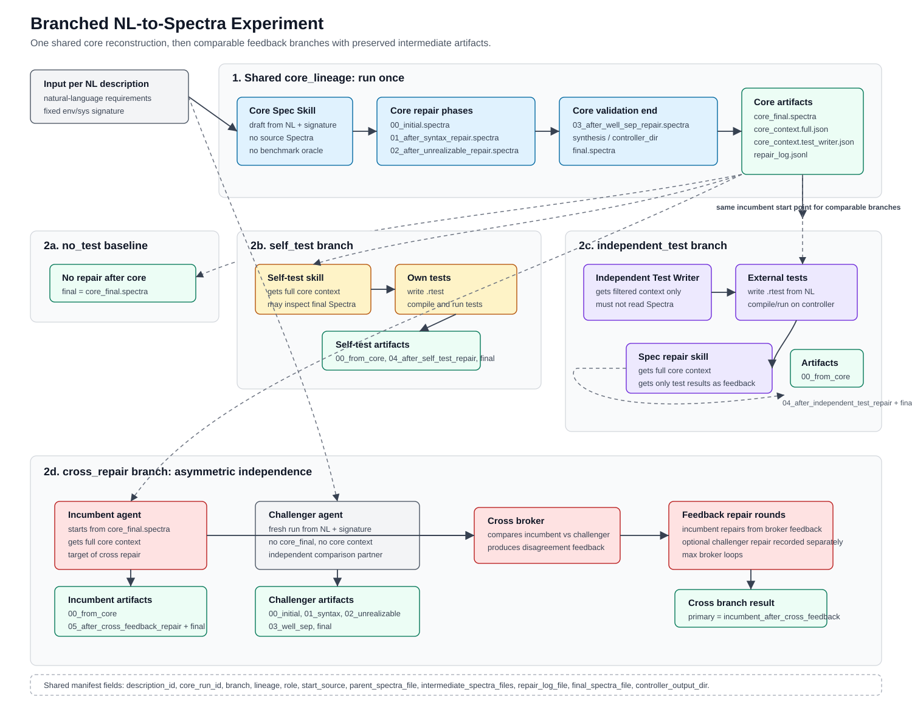

# Branching NL-to-Spectra Experiment Design

This proposal factors reconstruction into one shared core run followed by
branch-specific feedback strategies. The goal is to compare feedback methods
from the same incumbent Spectra starting point while preserving independent
lineages where needed.

Diagram:

Key idea:

- `core_lineage` runs once per natural-language description and produces the
  shared `core_final.spectra`.
- `self_test` and `independent_test` repair the same core incumbent.
- `cross_repair` has two roles:
  - `incumbent`: starts from `core_final.spectra`.
  - `challenger`: starts fresh from NL plus signature and keeps its own full
    intermediate Spectra history.
- Every lineage still archives stable intermediate Spectra files and a
  `repair_log.jsonl`.

